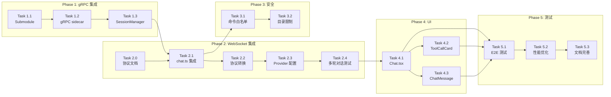

# openclaude 集成实现计划（修订版）

**日期**：2026-04-10
**基于**：2026-04-10-openclaude-integration-design.md（修订版）
**架构**：gRPC 代理模式

---

## 重大架构变更（ Spike 验证后）

| 原方案 | 问题 | 修订后 |
|--------|------|--------|
| `new OpenClaudeAgent(gateway, toolAdapter)` | 无此类可导出 | 使用 gRPC 服务器 |
| ToolAdapter 桥接工具 | 复杂度高，收益低 | 直接使用 openclaude 原生工具 |
| 直接复用 web-ai-ide AI Provider | 不可注入 | 通过环境变量传递 API Key |

---

## Phase 0：Spike 验证（已完成 ✅）

**验证结论**：
- openclaude v0.1.8 无导出类，不能作为库直接调用
- 内置 gRPC 服务器可用：`src/grpc/server.ts`
- gRPC Chat 是 bidirectional streaming 接口
- Provider 配置通过环境变量，不支持注入

**依赖**：无

---

## Phase 1：gRPC 服务集成（第 1-2 周）

### Task 1.1：添加 openclaude 作为 Git Submodule

**文件**：`packages/openclaude/`

**步骤**：
```bash
cd packages
git submodule add git@github.com:Gitlawb/openclaude.git openclaude
cd openclaude
npm install
npm run build
```

**验证**：
- [ ] submodule 正确克隆
- [ ] build 成功生成 dist/
- [ ] `node dist/cli.mjs --version` 正常运行

**依赖**：无

---

### Task 1.2：启动 gRPC 服务器作为 sidecar

**文件**：`packages/server/src/services/openclaude-grpc.ts`

**实现内容**：

```typescript
import { spawn, ChildProcess } from 'child_process';
import * as grpc from '@grpc/grpc-js';
import * as protoLoader from '@grpc/proto-loader';
import path from 'path';

export class OpenClaudeGrpcService {
  private proc: ChildProcess | null = null;
  private client: any = null;
  private readonly port = 50051;

  async start(): Promise<void> {
    return new Promise((resolve, reject) => {
      this.proc = spawn('node', [
        'dist/cli.mjs',
        'dev:grpc'
      ], {
        cwd: path.join(__dirname, '../../openclaude'),
        env: {
          ...process.env,
          GRPC_PORT: String(this.port),
        },
        stdio: ['ignore', 'pipe', 'pipe'],
      });

      this.proc.on('error', reject);
      this.proc.stdout?.on('data', (data) => {
        if (data.toString().includes('running')) {
          resolve();
        }
      });
    });
  }

  async stop(): Promise<void> {
    this.proc?.kill();
  }
}
```

**验证**：
- [ ] gRPC 服务器成功启动
- [ ] 端口 50051 可访问

**依赖**：Task 1.1

---

### Task 1.3：创建 AgentSessionManager（生命周期管理）

**文件**：`packages/server/src/services/agent-session-manager.ts`

**实现内容**：

```typescript
import * as grpc from '@grpc/grpc-js';

interface Session {
  call: grpc.ClientDuplexStream;
  lastActivity: number;
  userId: string;
}

export class AgentSessionManager {
  private sessions: Map<string, Session> = new Map();
  private cleanupInterval: NodeJS.Timeout;

  constructor(
    private grpcClient: any,
    private onSessionEnd?: (sessionId: string) => void
  ) {
    // 每 5 分钟清理超时 session
    this.cleanupInterval = setInterval(() => this.cleanup(), 5 * 60 * 1000);
  }

  create(sessionId: string, userId: string, workingDirectory: string): grpc.ClientDuplexStream {
    const call = this.grpcClient.Chat();

    call.on('data', (msg: any) => {
      this.updateActivity(sessionId);
      // 处理来自 gRPC 的消息
    });

    call.on('end', () => {
      this.remove(sessionId);
    });

    this.sessions.set(sessionId, {
      call,
      lastActivity: Date.now(),
      userId,
    });

    return call;
  }

  send(sessionId: string, message: any): boolean {
    const session = this.sessions.get(sessionId);
    if (!session) return false;
    session.call.write(message);
    session.lastActivity = Date.now();
    return true;
  }

  remove(sessionId: string): void {
    const session = this.sessions.get(sessionId);
    if (session) {
      session.call.cancel();
      this.sessions.delete(sessionId);
      this.onSessionEnd?.(sessionId);
    }
  }

  private cleanup(): void {
    const TIMEOUT_MS = 30 * 60 * 1000;
    const now = Date.now();

    for (const [id, session] of this.sessions) {
      if (now - session.lastActivity > TIMEOUT_MS) {
        this.remove(id);
      }
    }
  }

  destroy(): void {
    clearInterval(this.cleanupInterval);
    for (const [id] of this.sessions) {
      this.remove(id);
    }
  }
}
```

**验证**：
- [ ] Session 创建和删除正确
- [ ] 超时清理机制工作
- [ ] WebSocket 断开时正确清理

**依赖**：Task 1.2

---

## Phase 2：WebSocket 集成（第 3-4 周）

### Task 2.0：WebSocket 消息协议文档（前置）

**文件**：`docs/websocket-protocol.md`（新建）

**协议定义**：

| 事件类型 | 方向 | 字段 | 说明 |
|---------|------|------|------|
| `message` | 前端→后端 | `{ type, content }` | 用户发送消息 |
| `text` | 后端→前端 | `{ type, content }` | AI 文本响应 |
| `tool_call` | 后端→前端 | `{ type, toolCallId, toolName, arguments }` | 工具调用请求 |
| `tool_result` | 后端→前端 | `{ type, toolCallId, result }` | 工具执行结果 |
| `done` | 后端→前端 | `{ type }` | AI 响应完成 |
| `error` | 后端→前端 | `{ type, content, code? }` | 错误信息 |

**依赖**：无

---

### Task 2.1：修改 chat.ts 集成 AgentSessionManager

**文件**：`packages/server/src/routes/chat.ts`

**实现内容**：

```typescript
import { AgentSessionManager } from '../services/agent-session-manager.js';
import { OpenClaudeGrpcService } from '../services/openclaude-grpc.js';

const grpcService = new OpenClaudeGrpcService();
const sessionManager = new AgentSessionManager(grpcClient, (sessionId) => {
  // session 结束回调
});

socket.on('message', async (message: Buffer) => {
  try {
    const data = JSON.parse(message.toString());

    if (data.type === 'message' && data.content) {
      // 1. 保存用户消息
      await sessionService.addMessage({
        sessionId: activeSessionId,
        role: 'user',
        content: data.content,
      });

      // 2. 转发到 gRPC
      const sent = sessionManager.send(activeSessionId, {
        request: {
          session_id: activeSessionId,
          message: {
            role: 'user',
            content: data.content,
          },
          working_directory: getWorkingDir(activeSessionId),
        },
      });

      if (!sent) {
        // 创建新 session
        const call = sessionManager.create(
          activeSessionId,
          userId,
          getWorkingDir(activeSessionId)
        );

        call.write({
          request: {
            session_id: activeSessionId,
            message: {
              role: 'user',
              content: data.content,
            },
            working_directory: getWorkingDir(activeSessionId),
          },
        });
      }
    }
  } catch (error) {
    socket.send(JSON.stringify({
      type: 'error',
      content: error instanceof Error ? error.message : 'Unknown error',
    }));
  }
});

socket.on('close', () => {
  sessionManager.remove(activeSessionId);
});
```

**验证**：
- [ ] WebSocket 消息正确转发到 gRPC
- [ ] gRPC 响应正确转发到前端
- [ ] WebSocket 断开时 session 正确清理

**依赖**：Task 1.3, Task 2.0

---

### Task 2.2：gRPC 事件到 WebSocket 协议转换

**文件**：`packages/server/src/services/openclaude-grpc.ts`

**实现内容**：

```typescript
// gRPC 事件类型映射到 WebSocket 协议
interface GrpcEvent {
  message?: {
    content?: string;
    tool_call?: {
      id: string;
      name: string;
      input: Record<string, any>;
    };
    is_complete?: boolean;
  };
  error?: {
    message: string;
    code: string;
  };
}

function translateToWebSocket(grpcEvent: GrpcEvent, socket: any): void {
  if (grpcEvent.error) {
    socket.send(JSON.stringify({
      type: 'error',
      content: grpcEvent.error.message,
      code: grpcEvent.error.code,
    }));
    return;
  }

  if (grpcEvent.message?.content) {
    socket.send(JSON.stringify({
      type: 'text',
      content: grpcEvent.message.content,
    }));
  }

  if (grpcEvent.message?.tool_call) {
    socket.send(JSON.stringify({
      type: 'tool_call',
      toolCallId: grpcEvent.message.tool_call.id,
      toolName: grpcEvent.message.tool_call.name,
      arguments: grpcEvent.message.tool_call.input,
    }));
  }

  if (grpcEvent.message?.is_complete) {
    socket.send(JSON.stringify({ type: 'done' }));
  }
}
```

**验证**：
- [ ] gRPC text 事件正确转换为 WebSocket text
- [ ] gRPC tool_call 事件正确转换为 WebSocket tool_call
- [ ] 错误正确传递

**依赖**：Task 2.1

---

### Task 2.3：Provider 配置桥接

**文件**：`packages/server/src/services/openclaude-grpc.ts`

**实现内容**：

```typescript
// 通过环境变量传递 Provider 配置
async function configureProvider(userId: string): Promise<void> {
  const session = await sessionService.getSession(userId);
  const user = await prisma.user.findUnique({ where: { id: session.userId } });
  const config = decryptApiKeys(user.apiKeys);
  const provider = config.providers.find(p => p.id === config.currentProviderId);

  // 设置环境变量（传递给子进程）
  process.env.OPENAI_API_KEY = provider.apiKey;
  process.env.OPENAI_BASE_URL = provider.baseUrl;
  process.env.OPENAI_MODEL = provider.model;

  // 或使用 Anthropic
  if (provider.type === 'anthropic') {
    process.env.ANTHROPIC_API_KEY = provider.apiKey;
    process.env.ANTHROPIC_MODEL = provider.model;
  }
}
```

**验证**：
- [ ] Provider 配置正确传递到 gRPC 进程
- [ ] 多用户切换时环境变量正确隔离

**依赖**：Task 2.1

---

### Task 2.4：测试多轮对话

**验证内容**：
- [ ] 消息历史正确传递
- [ ] 多轮对话上下文保持
- [ ] Streaming 输出连续

**依赖**：Task 2.1, Task 2.2, Task 2.3

---

## Phase 3：安全与工具限制（第 5-6 周）

### Task 3.1：工具命令白名单

**文件**：`packages/server/src/services/tool-whitelist.ts`

**实现内容**：

```typescript
const ALLOWED_COMMANDS = new Set([
  // 文件操作
  'ls', 'la', 'll', 'find', 'grep', 'rg', 'cat', 'head', 'tail', 'wc',
  'mkdir', 'rm', 'rmdir', 'cp', 'mv', 'touch', 'stat', 'file',
  'tar', 'gzip', 'gunzip', 'zip', 'unzip',
  // Git
  'git', 'gh',
  // 包管理
  'npm', 'pnpm', 'yarn', 'bun', 'pip', 'pip3', 'python', 'python3',
  // 开发工具
  'node', 'tsc', 'tsx', 'jest', 'vitest', 'eslint', 'prettier',
  'cargo', 'rustc', 'go', 'java', 'javac',
  'make', 'cmake', 'gcc', 'g++',
  // 其他
  'echo', 'pwd', 'cd', 'which', 'whoami', 'env', 'date',
]);

const BLOCKED_PATTERNS = [
  /sudo/, /su /, /chmod \d{4}/, /chown/, /passwd/,
  /curl.*-T/, /wget.*-O.*\//, /nc .*-e/, /bash -i/,
  /\|\s*sh/, /\|\s*bash/, /\$\(.*\)/, /`.*`/,
];

const DANGEROUS_COMMANDS = new Set([
  'dd', 'mkfs', 'fdisk', 'parted',
  ':(){:|:&};:', // Fork bomb pattern
]);

export function isCommandAllowed(command: string): boolean {
  const parts = command.trim().split(/\s+/);
  const cmd = parts[0];

  if (DANGEROUS_COMMANDS.has(cmd)) return false;

  for (const pattern of BLOCKED_PATTERNS) {
    if (pattern.test(command)) return false;
  }

  return ALLOWED_COMMANDS.has(cmd);
}
```

**验证**：
- [ ] 白名单内命令允许执行
- [ ] 黑名单模式正确拦截
- [ ] 危险命令正确拦截

**依赖**：Task 2.1

---

### Task 3.2：工作目录限制

**文件**：`packages/server/src/services/tool-whitelist.ts`

**实现内容**：

```typescript
const WORKSPACE_ROOT = process.env.WORKSPACE_ROOT || '/tmp/web-ai-ide/workspaces';

export function isPathAllowed(path: string): boolean {
  const resolved = path.resolve(path);

  // 禁止路径遍历
  if (resolved.includes('..')) return false;

  // 必须在工作目录内
  if (!resolved.startsWith(WORKSPACE_ROOT)) return false;

  return true;
}

export function sanitizeWorkingDirectory(workspaceId: string): string {
  const userDir = path.join(WORKSPACE_ROOT, workspaceId);

  // 确保目录存在
  if (!fs.existsSync(userDir)) {
    fs.mkdirSync(userDir, { recursive: true });
  }

  return userDir;
}
```

**验证**：
- [ ] 路径遍历攻击被阻止
- [ ] 工作目录隔离正确

**依赖**：Task 3.1

---

## Phase 4：UI 优化（第 7-8 周）

### Task 4.1：修改 Chat.tsx 流式显示

**文件**：`packages/electron/src/components/Chat.tsx`

**实现内容**：与之前版本相同，添加 streaming 状态管理和 error 事件处理。

**依赖**：Task 2.1

---

### Task 4.2：优化 ToolCallCard 样式

**文件**：`packages/electron/src/components/ToolCallCard.tsx`

**实现内容**：应用 glass-panel 效果，与 web-ai-ide 设计系统统一。

**依赖**：Task 4.1

---

### Task 4.3：完善 ChatMessage 组件

**文件**：`packages/electron/src/components/ChatMessage.tsx`

**添加功能**：AI 消息前缀、streaming 高亮、错误状态显示。

**依赖**：Task 4.1

---

## Phase 5：测试与优化（第 9-10 周）

### Task 5.1：端到端测试

**测试场景**：
1. 用户登录 → 创建项目 → 打开 AI Chat
2. 发送 "帮我分析项目结构"
3. 验证命令白名单生效
4. 验证多轮对话

**依赖**：Phase 2, Phase 3

---

### Task 5.2：性能优化

**优化点**：
1. gRPC 连接池
2. Session 内存优化
3. 消息压缩

**依赖**：Task 5.1

---

### Task 5.3：文档完善

**文档内容**：
1. README 更新
2. 安全配置说明
3. 开发指南

**依赖**：Task 5.2

---

## 任务依赖图



---

## 检查点

### 检查点 1 (Phase 1 完成后)
- [ ] openclaude submodule 正确添加
- [ ] gRPC 服务器成功启动
- [ ] SessionManager 生命周期正确

### 检查点 2 (Phase 2 完成后)
- [ ] WebSocket 消息正确转发到 gRPC
- [ ] gRPC 响应正确转换到 WebSocket
- [ ] Provider 配置正确传递

### 检查点 3 (Phase 3 完成后)
- [ ] 命令白名单正确工作
- [ ] 路径限制正确工作
- [ ] 危险命令被拦截

### 检查点 4 (Phase 4 完成后)
- [ ] UI 混合风格正确
- [ ] glass-panel 效果正常

### 检查点 5 (Phase 5 完成后)
- [ ] 端到端测试通过
- [ ] 性能指标达标

---

## 与原方案对比

| 方面 | 原方案 | 修订方案 |
|------|--------|----------|
| 集成方式 | 库调用 | gRPC sidecar |
| 工具系统 | ToolAdapter 桥接 | openclaude 原生 + 白名单 |
| Provider | 直接注入 | 环境变量传递 |
| 生命周期 | Map 无管理 | AgentSessionManager |
| 安全 | 未考虑 | 命令白名单 + 目录限制 |

---

*计划创建：2026-04-10（修订版 - 基于 Spike 验证）*