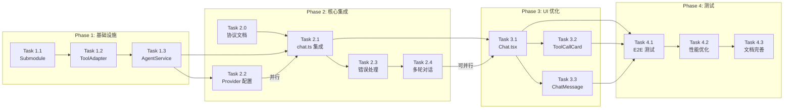

# openclaude 集成实现计划

**日期**：2026-04-10
**基于**：2026-04-10-openclaude-integration-design.md

---

## Phase 1：基础设施（第 1-2 周）

### Task 1.1：添加 openclaude 作为 Git Submodule

**文件**：`packages/openclaude/`

**步骤**：
```bash
cd packages
git submodule add git@github.com:Gitlawb/openclaude.git openclaude
cd openclaude
npm install
npm run build
```

**说明**：本地开发环境执行，Windows/macOS/Linux 均适用。

**验证**：
- [ ] submodule 正确克隆
- [ ] build 成功生成 dist/
- [ ] `node dist/cli.mjs --version` 正常运行

**依赖**：无

---

### Task 1.2：创建 ToolAdapter 基础类

**文件**：`packages/server/src/services/tool-adapter.ts`

**实现内容**：

```typescript
// 1. 基础结构
export interface ToolResult {
  success: boolean;
  output?: string;
  error?: string;
}

export class ToolAdapter {
  constructor(
    private ptyService: PTYService,
    private fileService: any
  );

  // 2. bash 工具
  async bash(command: string, cwd?: string): Promise<ToolResult> {
    // 调用 ptyService 执行命令
    // 返回执行结果
  }

  // 3. file read 工具
  async fileRead(path: string): Promise<ToolResult> {
    // 调用 /api/files/read
  }

  // 4. file write 工具
  async fileWrite(path: string, content: string): Promise<ToolResult> {
    // 调用 /api/files/write
  }
}
```

**步骤**：
1. 创建 `tool-adapter.ts` 文件
2. 实现 `bash()` 方法 - 桥接到 PTYService
3. 实现 `fileRead()` 方法 - 桥接到 filesRouter
4. 实现 `fileWrite()` 方法 - 桥接到 filesRouter
5. 添加错误处理和超时控制

**验证**：
- [ ] `bash('ls -la')` 返回正确输出
- [ ] `fileRead('/path/to/file')` 返回文件内容
- [ ] `fileWrite('/path/to/file', 'content')` 成功写入

**依赖**：Task 1.1

---

### Task 1.3：创建 AgentService 封装

**文件**：`packages/server/src/services/agent-service.ts`

**实现内容**：

```typescript
import { AIGateway } from '@web-ai-ide/core';
import { ToolAdapter } from './tool-adapter';

export interface AgentConfig {
  sessionId: string;
  provider: AIProviderConfig;
}

export class AgentService {
  private agents: Map<string, any> = new Map();
  private toolAdapter: ToolAdapter;

  constructor(
    private gatewayFactory: (config: AIProviderConfig) => AIGateway,
    ptyService: PTYService,
    fileService: any
  ) {
    this.toolAdapter = new ToolAdapter(ptyService, fileService);
  }

  // 创建或获取 agent
  getOrCreateAgent(sessionId: string, config: AgentConfig): any {
    if (!this.agents.has(sessionId)) {
      const gateway = this.gatewayFactory(config.provider);
      // 创建 openclaude agent 实例
      this.agents.set(sessionId, new OpenClaudeAgent(gateway, this.toolAdapter));
    }
    return this.agents.get(sessionId);
  }

  // 流式对话
  async *streamChat(sessionId: string, messages: any[]): AsyncGenerator<any> {
    const agent = this.agents.get(sessionId);
    if (!agent) throw new Error('Agent not found');
    yield* agent.streamChat(messages);
  }

  // 终止 agent
  kill(sessionId: string): void {
    const agent = this.agents.get(sessionId);
    if (agent) {
      agent.kill();
      this.agents.delete(sessionId);
    }
  }
}
```

**设计说明**：与设计文档保持一致，使用 `gatewayFactory` 依赖注入。

**步骤**：
1. 创建 `agent-service.ts`
2. 初始化 ToolAdapter
3. 实现 `getOrCreateAgent()` 方法
4. 实现 `streamChat()` 异步生成器
5. 实现 `kill()` 方法

**验证**：
- [ ] AgentService 正确初始化
- [ ] `getOrCreateAgent()` 返回 agent 实例
- [ ] `streamChat()` 正确 yield 事件

**依赖**：Task 1.2

---

## Phase 2：核心集成（第 3-4 周）

### Task 2.0：WebSocket 消息协议文档（前置）

**文件**：`docs/websocket-protocol.md`（新建）

**协议定义**：

| 事件类型 | 方向 | 字段 | 说明 |
|---------|------|------|------|
| `message` | 前端→后端 | `{ type, content }` | 用户发送消息 |
| `text` | 后端→前端 | `{ type, content }` | AI 文本响应 |
| `tool_call` | 后端→前端 | `{ type, toolCallId, toolName, arguments }` | 工具调用请求 |
| `tool_result` | 后端→前端 | `{ type, toolCallId, success, output?, error? }` | 工具执行结果 |
| `done` | 后端→前端 | `{ type }` | AI 响应完成 |
| `error` | 后端→前端 | `{ type, content, code? }` | 错误信息 |

**tool_call 事件参数示例**：
```json
{
  "type": "tool_call",
  "toolCallId": "tool_123",
  "toolName": "bash",
  "arguments": { "command": "ls -la", "cwd": "/home/user" }
}
```

**tool_result 事件参数示例**：
```json
{
  "type": "tool_result",
  "toolCallId": "tool_123",
  "success": true,
  "output": "total 128\ndrwxr-xr-x  12 user  staff   384 Apr 10 12:00 ..."
}
```

**验证**：
- [ ] 协议文档创建完成
- [ ] 前后端字段定义一致

**依赖**：无

---

### Task 2.1：修改 chat.ts 集成 AgentService

**文件**：`packages/server/src/routes/chat.ts`

**前置条件**：Task 2.2 (Provider 配置桥接) 应先完成或使用占位符

**修改内容**：

1. 导入 AgentService
2. 初始化 AgentService 实例
3. 修改 WebSocket 消息处理
4. 添加错误处理

**代码变更**：

```typescript
// 添加导入
import { AgentService } from '../services/agent-service.js';

// 初始化（Task 2.2 完成后，providerLoader 应替换为实际实现）
const agentService = new AgentService(
  (config) => new AIGateway(config),  // gatewayFactory
  getShellRegistry().getPTYService(),  // ptyService
  null  // fileService (后续注入)
);

// 修改消息处理
socket.on('message', async (message: Buffer) => {
  try {
    const data = JSON.parse(message.toString());

    if (data.type === 'message' && data.content) {
      // 1. 保存用户消息
      await sessionService.addMessage({
        sessionId: activeSessionId,
        role: 'user',
        content: data.content,
      });

      // 2. 获取或创建 agent（占位：Task 2.2 完成后替换 providerLoader）
      const providerConfig = await loadProviderConfigFromSession(activeSessionId); // TODO: 实现
      const agent = agentService.getOrCreateAgent(activeSessionId, {
        provider: providerConfig,
      });

      // 3. 获取历史消息
      const history = await sessionService.getMessages(activeSessionId);

      // 4. 流式处理
      for await (const event of agent.streamChat(history)) {
        switch (event.type) {
          case 'text':
            socket.send(JSON.stringify({ type: 'text', content: event.content }));
            break;
          case 'tool_call':
            socket.send(JSON.stringify({
              type: 'tool_call',
              toolCallId: event.toolCallId,
              toolName: event.name,
              arguments: event.arguments,
            }));
            break;
          case 'tool_result':
            socket.send(JSON.stringify({
              type: 'tool_result',
              toolCallId: event.toolCallId,
              result: event.result,
            }));
            break;
          case 'done':
            socket.send(JSON.stringify({ type: 'done' }));
            break;
        }
      }
    }
  } catch (error) {
    // 错误处理：发送 error 类型事件
    socket.send(JSON.stringify({
      type: 'error',
      content: error instanceof Error ? error.message : 'Unknown error',
    }));
  }
});
```

**步骤**：
1. 添加 AgentService 导入
2. 创建 AgentService 实例（使用占位 providerLoader）
3. 修改 `message` 类型处理
4. 实现完整的 streaming 事件处理
5. 添加 try-catch 错误处理

**验证**：
- [ ] WebSocket 连接成功
- [ ] 发送消息收到 AI 响应
- [ ] 工具调用事件正确发送
- [ ] 异常时发送 `error` 类型事件

**依赖**：Task 1.3, Task 2.2

---

### Task 2.2：AI Provider 配置桥接

**文件**：`packages/server/src/services/agent-service.ts`

**实现内容**：

```typescript
// 从 session 加载 provider 配置
private async loadProviderConfig(sessionId: string): Promise<AIProviderConfig> {
  const session = await sessionService.getSession(sessionId);
  const user = await prisma.user.findUnique({ where: { id: session.userId } });

  // 解密 apiKeys
  const decrypted = decryptApiKeys(user.apiKeys);

  // 返回 provider 配置
  return decrypted.providers.find(p => p.id === decrypted.currentProviderId);
}
```

**步骤**：
1. 在 AgentService 中添加 `loadProviderConfig()` 方法
2. 集成解密逻辑
3. 在 `getOrCreateAgent()` 中使用配置

**验证**：
- [ ] Agent 使用正确的 provider
- [ ] 配置变更时 agent 重新创建

**依赖**：无（可与 Task 2.1 并行）

---

### Task 2.3：WebSocket 错误处理与超时机制

**文件**：`packages/server/src/routes/chat.ts`

**实现内容**：

1. **Agent 调用超时控制**
   ```typescript
   const TIMEOUT_MS = 120000; // 2分钟

   const timeoutPromise = new Promise((_, reject) => {
     setTimeout(() => reject(new Error('Agent timeout')), TIMEOUT_MS);
   });

   try {
     await Promise.race([
       agent.streamChat(history),
       timeoutPromise
     ]);
   } catch (error) {
     socket.send(JSON.stringify({ type: 'error', content: error.message }));
   }
   ```

2. **工具执行超时 abort**
   ```typescript
   // 在 ToolAdapter 中添加
   async bash(command: string, cwd?: string, timeoutMs = 30000): Promise<ToolResult> {
     const controller = new AbortController();
     const timeout = setTimeout(() => controller.abort(), timeoutMs);
     try {
       // 执行逻辑
     } finally {
       clearTimeout(timeout);
     }
   }
   ```

3. **WebSocket 错误事件**
   - AI 调用失败 → `type: 'error'`
   - 工具执行超时 → `type: 'tool_result' { success: false }`
   - 连接异常 → `type: 'error' { code: 'CONNECTION_ERROR' }`

**验证**：
- [ ] Agent 超时正确抛出异常
- [ ] 工具执行超时正确 abort
- [ ] 前端正确显示错误状态

**依赖**：Task 2.1

---

### Task 2.4：测试多轮对话

**验证内容**：
- [ ] 消息历史正确传递
- [ ] 多轮对话上下文保持
- [ ] Streaming 输出连续
- [ ] 错误恢复机制工作

**依赖**：Task 2.1, Task 2.2, Task 2.3

---

## Phase 3：UI 优化（第 5-6 周）

本阶段重点关注前端交互体验优化，包括流式响应展示、工具调用卡片渲染和消息组件样式改进。

### Task 3.1：修改 Chat.tsx 流式显示

**文件**：`packages/electron/src/components/Chat.tsx`

**修改内容**：

1. 添加 streaming 状态管理
2. 实现增量文本渲染
3. 添加工具调用卡片显示

**代码变更**：

```typescript
// 状态
const [streamingContent, setStreamingContent] = useState('');
const [toolCalls, setToolCalls] = useState<ToolCall[]>([]);

// WebSocket 消息处理
socket.on('message', (event) => {
  const data = JSON.parse(event.data);

  switch (data.type) {
    case 'text':
      setStreamingContent(prev => prev + data.content);
      break;
    case 'tool_call':
      setToolCalls(prev => [...prev, data]);
      break;
    case 'done':
      // 保存消息到历史
      saveMessage(streamingContent);
      setStreamingContent('');
      break;
  }
});
```

**步骤**：
1. 添加 streaming 状态
2. 修改 render 方法支持增量显示
3. 添加工具调用卡片渲染

**验证**：
- [ ] 文本逐字显示
- [ ] 工具卡片正确展示
- [ ] 完成状态正确处理

**依赖**：Task 2.1

---

### Task 3.2：优化 ToolCallCard 样式

**文件**：`packages/electron/src/components/ToolCallCard.tsx`

**修改样式**：

```typescript
// glass-panel 效果
const cardStyle: React.CSSProperties = {
  background: 'rgba(10, 10, 13, 0.8)',
  backdropFilter: 'blur(12px)',
  border: '1px solid rgba(99, 102, 241, 0.2)',
  borderRadius: '8px',
  padding: '12px',
  margin: '8px 0',
};

// 终端输出样式
const outputStyle: React.CSSProperties = {
  fontFamily: 'JetBrains Mono, monospace',
  fontSize: '12px',
  background: 'rgba(0, 0, 0, 0.3)',
  padding: '8px',
  borderRadius: '4px',
  overflow: 'auto',
};
```

**验证**：
- [ ] glass-panel 效果正常
- [ ] 等宽字体显示
- [ ] 动画平滑

**依赖**：Task 3.1

---

### Task 3.3：完善 ChatMessage 组件

**文件**：`packages/electron/src/components/ChatMessage.tsx`

**添加功能**：
- AI 消息带 🤖 前缀或 indigo 图标
- streaming 时渐变高亮
- 错误状态红色显示

**验证**：
- [ ] 消息样式正确
- [ ] streaming 高亮正常

**依赖**：Task 3.1

---

## Phase 4：测试与优化（第 7-8 周）

### Task 4.1：端到端测试

**测试场景**：
1. 用户登录 → 创建项目 → 打开 AI Chat
2. 发送 "帮我分析项目结构"
3. 验证工具调用（bash ls, glob）
4. 验证多轮对话

**依赖**：Task 2.1, Task 3.1

---

### Task 4.2：性能优化

**优化点**：
1. Streaming buffer 大小调整
2. 工具调用并发控制
3. 消息历史截断策略

**依赖**：Task 4.1

---

### Task 4.3：文档完善

**文档内容**：
1. README 更新 - 集成说明
2. API 文档 - WebSocket 接口
3. 开发指南 - 调试方法

**依赖**：Task 4.2

---

## 任务依赖图



**说明**：
- 箭头表示依赖关系
- Phase 2 中 Task 2.1 和 Task 2.2 可并行开发
- Phase 3 的任务可与 Phase 2 部分并行

---

## 检查点

### 检查点 1 (Phase 1 完成后)
- [ ] openclaude submodule 正确添加
- [ ] ToolAdapter 基本方法工作
- [ ] AgentService 正确封装

### 检查点 2 (Phase 2 完成后)
- [ ] WebSocket 消息正确处理
- [ ] AI streaming 响应正常
- [ ] 工具调用链路完整

### 检查点 3 (Phase 3 完成后)
- [ ] UI 混合风格正确
- [ ] glass-panel 效果正常
- [ ] streaming 显示流畅

### 检查点 4 (Phase 4 完成后)
- [ ] 端到端测试通过
- [ ] 性能指标达标
- [ ] 文档完整

---

*计划创建：2026-04-10*