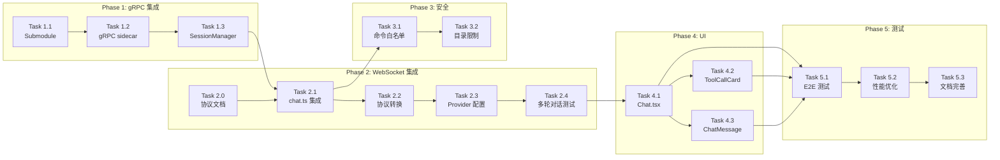

# openclaude 集成实现计划（修订版）

**日期**：2026-04-10
**基于**：2026-04-10-openclaude-integration-design.md（修订版）
**架构**：gRPC 代理模式

---

## 重大架构变更（ Spike 验证后）

| 原方案 | 问题 | 修订后 |
|--------|------|--------|
| `new OpenClaudeAgent(gateway, toolAdapter)` | 无此类可导出 | 使用 gRPC 服务器 |
| ToolAdapter 桥接工具 | 复杂度高，收益低 | 直接使用 openclaude 原生工具 |
| 直接复用 web-ai-ide AI Provider | 不可注入 | 通过环境变量传递 API Key |

---

## Phase 0：Spike 验证（已完成 ✅）

**验证结论**：
- openclaude v0.1.8 无导出类，不能作为库直接调用
- 内置 gRPC 服务器可用：`src/grpc/server.ts`
- proto 定义已确认：`text_chunk`, `tool_start`, `tool_result`, `action_required`
- Provider 配置通过 `applyProviderProfileToProcessEnv()` 设置（进程级别）
- 存在 `canUseTool` 钩子，可拦截工具调用

**关键发现**：
1. gRPC 是**单用户进程**，环境变量是进程级别，无法 per-request 隔离
2. **解决方案**：为每个用户启动独立的 gRPC sidecar 进程
3. 命令白名单可通过 `canUseTool` 钩子 + `action_required` 机制实现

**依赖**：无

---

## Phase 1：gRPC 服务集成（第 1-2 周）

### Task 1.1：添加 openclaude 作为 Git Submodule

**文件**：`packages/openclaude/`（从 `packages/openclaude-temp/` 移动）

**步骤**：
```bash
# 删除临时目录
rm -rf packages/openclaude-temp

# 添加 submodule
cd packages
git submodule add git@github.com:Gitlawb/openclaude.git openclaude
cd openclaude
npm install
npm run build
```

**说明**：`packages/openclaude-temp/` 已包含验证过的源码，可直接移动使用。

**验证**：
- [ ] submodule 正确克隆
- [ ] build 成功生成 dist/
- [ ] `node dist/cli.mjs --version` 正常运行

**依赖**：无

---

### Task 1.2：创建 AgentProcessManager（进程管理器）

**文件**：`packages/server/src/services/agent-process-manager.ts`

**实现内容**：

```typescript
import { spawn, ChildProcess } from 'child_process';
import * as grpc from '@grpc/grpc-js';
import * as protoLoader from '@grpc/proto-loader';
import path from 'path';

const PROTO_PATH = path.join(__dirname, '../../openclaude/src/proto/openclaude.proto');

interface AgentProcess {
  pid: number;
  port: number;
  userId: string;
  sessionId: string;
  lastActivity: number;
  proc: ChildProcess;
  client: any;  // gRPC 客户端
}

export class AgentProcessManager {
  private processes: Map<string, AgentProcess> = new Map();
  private portCounter = 50052;
  private packageDefinition: any;
  private protoDescriptor: any;

  constructor() {
    this.packageDefinition = protoLoader.loadSync(PROTO_PATH, {
      keepCase: true,
      longs: String,
      enums: String,
      defaults: true,
      oneofs: true,
    });
    this.protoDescriptor = grpc.loadPackageDefinition(this.packageDefinition);
  }

  private createGrpcClient(port: number): any {
    const client = new this.protoDescriptor.openclaude.v1.Agent(
      `localhost:${port}`,
      grpc.credentials.createInsecure()
    );
    return client;
  }

  async createProcess(userId: string, sessionId: string, provider: ProviderConfig): Promise<AgentProcess> {
    const port = this.portCounter++;
    const env = {
      ...process.env,
      ANTHROPIC_API_KEY: provider.apiKey,
      ANTHROPIC_BASE_URL: provider.baseUrl,
      ANTHROPIC_MODEL: provider.model,
      GRPC_PORT: String(port),
    };

    const proc = spawn('node', ['dist/cli.mjs', 'dev:grpc'], {
      cwd: path.join(__dirname, '../../openclaude'),
      env,
      stdio: ['ignore', 'pipe', 'pipe'],
    });

    // 等待进程启动
    await this.waitForPort(port);

    const client = this.createGrpcClient(port);

    const process: AgentProcess = {
      pid: proc.pid!,
      port,
      userId,
      sessionId,
      lastActivity: Date.now(),
      proc,
      client,
    };

    this.processes.set(`${userId}:${sessionId}`, process);
    return process;
  }

  private waitForPort(port: number): Promise<void> {
    return new Promise((resolve, reject) => {
      const startTime = Date.now();
      const timeout = 10000; // 10秒超时

      const check = () => {
        const client = new this.protoDescriptor.openclaude.v1.Agent(
          `localhost:${port}`,
          grpc.credentials.createInsecure()
        );

        // 尝试连接检测端口是否可用
        const deadline = new Date(Date.now() + 1000);
        client.waitForReady(deadline, (err: any) => {
          if (!err) {
            resolve();
          } else if (Date.now() - startTime > timeout) {
            reject(new Error(`Port ${port} did not become available in time`));
          } else {
            setTimeout(check, 100);
          }
        });
      };

      setTimeout(check, 100);
    });
  }

  async getOrCreateProcess(userId: string, sessionId: string, provider: ProviderConfig): Promise<AgentProcess> {
    const key = `${userId}:${sessionId}`;
    const existing = this.processes.get(key);

    if (existing && existing.pid) {
      return existing;
    }

    return this.createProcess(userId, sessionId, provider);
  }

  async destroyProcess(userId: string, sessionId: string): Promise<void> {
    const key = `${userId}:${sessionId}`;
    const process = this.processes.get(key);

    if (process) {
      process.proc.kill();
      this.processes.delete(key);
    }
  }

  cleanup(): void {
    const TIMEOUT_MS = 30 * 60 * 1000;
    const now = Date.now();

    for (const [key, proc] of this.processes) {
      if (now - proc.lastActivity > TIMEOUT_MS) {
        proc.proc.kill();
        this.processes.delete(key);
      }
    }
  }
}
```

**验证**：
- [ ] AgentProcessManager 正确初始化
- [ ] 为每个用户创建独立的 sidecar 进程
- [ ] gRPC 客户端正确连接
- [ ] 进程生命周期正确管理

**依赖**：Task 1.1

---

### Task 1.3：创建 AgentSessionManager（会话封装）

**文件**：`packages/server/src/services/agent-session-manager.ts`

**实现内容**：

```typescript
import * as grpc from '@grpc/grpc-js';

interface Session {
  call: grpc.ClientDuplexStream;
  lastActivity: number;
  userId: string;
  pendingRequests: Map<string, (reply: string) => void>;
}

export class AgentSessionManager {
  private sessions: Map<string, Session> = new Map();

  constructor(private processManager: AgentProcessManager) {
    // 定时清理
    setInterval(() => this.processManager.cleanup(), 5 * 60 * 1000);
  }

  async createSession(
    userId: string,
    sessionId: string,
    provider: ProviderConfig
  ): Promise<string> {
    // 通过 processManager 获取 gRPC 客户端
    const process = await this.processManager.getOrCreateProcess(userId, sessionId, provider);
    const call = process.client.Chat();

    const pendingRequests = new Map<string, (reply: string) => void>();

    call.on('data', (msg: any) => {
      this.updateActivity(sessionId);
      // 处理来自 gRPC 的消息
    });

    call.on('end', () => {
      this.remove(sessionId);
    });

    this.sessions.set(sessionId, {
      call,
      lastActivity: Date.now(),
      userId,
      pendingRequests,
    });

    return sessionId;
  }

  send(sessionId: string, message: any): boolean {
    const session = this.sessions.get(sessionId);
    if (!session) return false;
    session.call.write(message);
    session.lastActivity = Date.now();
    return true;
  }

  remove(sessionId: string): void {
    const session = this.sessions.get(sessionId);
    if (session) {
      session.call.cancel();
      this.sessions.delete(sessionId);
    }
  }

  private updateActivity(sessionId: string): void {
    const session = this.sessions.get(sessionId);
    if (session) {
      session.lastActivity = Date.now();
    }
  }

  destroy(): void {
    for (const [id] of this.sessions) {
      this.remove(id);
    }
  }
}
```

**验证**：
- [ ] Session 创建和删除正确
- [ ] gRPC 流正确管理
- [ ] WebSocket 断开时正确清理

**依赖**：Task 1.2

---

## Phase 2：WebSocket 集成（第 3-4 周）

### Task 2.0：WebSocket 消息协议文档（前置）

**文件**：`docs/websocket-protocol.md`（新建）

**协议定义**：

| 事件类型 | 方向 | 字段 | 说明 |
|---------|------|------|------|
| `message` | 前端→后端 | `{ type, content }` | 用户发送消息 |
| `text` | 后端→前端 | `{ type, content }` | AI 文本响应 |
| `tool_call` | 后端→前端 | `{ type, toolCallId, toolName, arguments }` | 工具调用请求 |
| `tool_result` | 后端→前端 | `{ type, toolCallId, result }` | 工具执行结果 |
| `done` | 后端→前端 | `{ type }` | AI 响应完成 |
| `error` | 后端→前端 | `{ type, content, code? }` | 错误信息 |

**依赖**：无

---

### Task 2.1：修改 chat.ts 集成 AgentSessionManager

**文件**：`packages/server/src/routes/chat.ts`

**实现内容**：

```typescript
import { AgentProcessManager } from '../services/agent-process-manager.js';
import { AgentSessionManager } from '../services/agent-session-manager.js';

const processManager = new AgentProcessManager();
const sessionManager = new AgentSessionManager(processManager);

socket.on('message', async (message: Buffer) => {
  try {
    const data = JSON.parse(message.toString());

    if (data.type === 'message' && data.content) {
      // 1. 保存用户消息
      await sessionService.addMessage({
        sessionId: activeSessionId,
        role: 'user',
        content: data.content,
      });

      // 2. 获取或创建 session（每个用户有独立的 sidecar 进程）
      const providerConfig = await loadProviderConfigFromSession(activeSessionId);
      await sessionManager.createSession(userId, activeSessionId, providerConfig);

      // 3. 发送消息到 gRPC
      sessionManager.send(activeSessionId, {
        request: {
          session_id: activeSessionId,
          message: data.content,
          working_directory: getWorkingDir(activeSessionId),
        },
      });
    }

    if (data.type === 'user_confirm') {
      // 处理用户确认
      sessionManager.sendConfirm(activeSessionId, data.promptId, data.approved);
    }
  } catch (error) {
    socket.send(JSON.stringify({
      type: 'error',
      content: error instanceof Error ? error.message : 'Unknown error',
    }));
  }
});

socket.on('close', () => {
  sessionManager.remove(activeSessionId);
});
```

**验证**：
- [ ] WebSocket 消息正确转发到 gRPC
- [ ] gRPC 响应正确转发到前端
- [ ] user_confirm 正确处理
- [ ] WebSocket 断开时 session 正确清理

**依赖**：Task 1.3, Task 2.0

---

### Task 2.2：gRPC 事件到 WebSocket 协议转换（基于实际 proto）

**文件**：`packages/server/src/services/protocol-translator.ts`

**实现内容**（根据 proto 定义）：

```typescript
// 基于实际 proto 定义
interface GrpcServerMessage {
  text_chunk?: { text: string };
  tool_start?: { tool_name: string; arguments_json: string; tool_use_id: string };
  tool_result?: { tool_name: string; output: string; is_error: boolean; tool_use_id: string };
  action_required?: { prompt_id: string; question: string; type: string };
  done?: { full_text: string; prompt_tokens: number; completion_tokens: number };
  error?: { message: string; code: string };
}

export function translateToWebSocket(event: GrpcServerMessage, socket: any): void {
  if (event.text_chunk) {
    socket.send(JSON.stringify({
      type: 'text',
      content: event.text_chunk.text,
    }));
  }

  if (event.tool_start) {
    socket.send(JSON.stringify({
      type: 'tool_call',
      toolCallId: event.tool_start.tool_use_id,
      toolName: event.tool_start.tool_name,
      arguments: JSON.parse(event.tool_start.arguments_json),
    }));
  }

  if (event.tool_result) {
    socket.send(JSON.stringify({
      type: 'tool_result',
      toolCallId: event.tool_result.tool_use_id,
      result: {
        success: !event.tool_result.is_error,
        output: event.tool_result.output,
        error: event.tool_result.is_error ? event.tool_result.output : undefined,
      },
    }));
  }

  if (event.action_required) {
    socket.send(JSON.stringify({
      type: 'action_required',
      promptId: event.action_required.prompt_id,
      question: event.action_required.question,
      actionType: event.action_required.type,
    }));
  }

  if (event.done) {
    socket.send(JSON.stringify({ type: 'done' }));
  }

  if (event.error) {
    socket.send(JSON.stringify({
      type: 'error',
      content: event.error.message,
      code: event.error.code,
    }));
  }
}
```

**proto 字段映射确认**：
- `text_chunk.text` → `text.content`
- `tool_start.tool_use_id` → `tool_call.toolCallId`
- `tool_start.arguments_json` → `tool_call.arguments`（需要 JSON.parse）
- `tool_result.is_error` → `tool_result.success = !is_error`

**验证**：
- [ ] text_chunk 正确转换为 text
- [ ] tool_start 正确转换为 tool_call
- [ ] tool_result 正确处理 is_error 映射
- [ ] action_required 正确传递

**依赖**：Task 2.1

---

### Task 2.3：Provider 配置桥接

**文件**：`packages/server/src/services/agent-process-manager.ts`

**实现内容**：每个用户有独立的 sidecar 进程，Provider 配置通过进程环境变量隔离。

```typescript
async createProcess(userId: string, sessionId: string, provider: ProviderConfig): Promise<AgentProcess> {
  const port = this.portCounter++;
  const env = {
    ...process.env,
    // 根据 provider 类型设置环境变量
    // 由于每个用户有独立进程，环境变量天然隔离
    ...(provider.type === 'anthropic'
      ? {
          ANTHROPIC_API_KEY: provider.apiKey,
          ANTHROPIC_BASE_URL: provider.baseUrl,
          ANTHROPIC_MODEL: provider.model,
        }
      : {
          OPENAI_API_KEY: provider.apiKey,
          OPENAI_BASE_URL: provider.baseUrl,
          OPENAI_MODEL: provider.model,
        }),
    GRPC_PORT: String(port),
  };

  // 启动独立进程...
}
```

**多用户隔离机制**：
- 每个用户的 sidecar 是独立进程（port 不同）
- 独立进程有独立的环境变量
- 用户 A 的请求不会影响用户 B 的 API Key

**验证**：
- [ ] Anthropic provider 正确设置环境变量
- [ ] OpenAI provider 正确设置环境变量
- [ ] 多用户同时使用时 API Key 隔离正确

**依赖**：Task 2.1

---

### Task 2.4：测试多轮对话

**验证内容**：
- [ ] 消息历史正确传递
- [ ] 多轮对话上下文保持
- [ ] Streaming 输出连续

**依赖**：Task 2.1, Task 2.2, Task 2.3

---

## Phase 3：安全与工具限制（第 5-6 周）

### Task 3.1：命令白名单（通过 openclaude 配置）

**文件**：`packages/openclaude/`（需修改 openclaude 源码）

**重要说明**：openclaude 的工具系统是内置的，无法从外部拦截。但可以通过以下方式实现白名单：

1. **修改 openclaude 源码**：在 `getTools()` 中添加白名单过滤
2. **使用 openclaude 的 `dangerouslyDisablePromptSecurity` 配置**（如适用）
3. **通过 `action_required` 机制让用户确认危险命令**

**实现内容**：

```typescript
// 在 openclaude 源码中添加白名单过滤
// packages/openclaude/src/tools/index.ts

const ALLOWED_TOOLS = new Set([
  'Bash', 'Read', 'Write', 'Edit', 'Grep', 'Glob',
  'Notebook', 'WebSearch', 'WebFetch', 'TodoWrite',
]);

const BLOCKED_PATTERNS = [
  /sudo/, /su /, /chmod \d{4}/, /chown/,
  /curl.*-T/, /wget.*-O.*\//, /nc .*-e/,
];

export function getToolsFiltered(): Tool[] {
  const tools = getTools();
  return tools.filter(tool => {
    // 只允许白名单工具
    if (!ALLOWED_TOOLS.has(tool.name)) {
      return false;
    }

    // Bash 命令检查在运行时进行
    return true;
  });
}
```

**替代方案**：使用 `action_required` 机制

```typescript
// 通过 action_required 让用户确认危险命令
// 前端收到 action_required 事件后显示确认对话框
socket.on('message', (event) => {
  const data = JSON.parse(event.data);

  if (data.type === 'action_required') {
    showConfirmDialog({
      title: 'Command Confirmation',
      message: data.question,
      onConfirm: () => {
        socket.send(JSON.stringify({
          type: 'user_confirm',
          promptId: data.promptId,
          approved: true,
        }));
      },
      onDeny: () => {
        socket.send(JSON.stringify({
          type: 'user_confirm',
          promptId: data.promptId,
          approved: false,
        }));
      },
    });
  }
});
```

**验证**：
- [ ] 白名单工具过滤生效
- [ ] 危险命令通过 action_required 请求确认
- [ ] 用户拒绝时命令不执行

**依赖**：Task 2.2

---

### Task 3.2：工作目录限制

**文件**：`packages/server/src/services/tool-whitelist.ts`

**实现内容**：

```typescript
import path from 'path';

const WORKSPACE_ROOT = process.env.WORKSPACE_ROOT || '/tmp/web-ai-ide/workspaces';

export function isPathAllowed(targetPath: string): boolean {
  // resolve 会解析路径，消除 .. 等特殊字符
  const resolved = path.resolve(targetPath);

  // 检查是否在允许的工作目录内
  return resolved.startsWith(WORKSPACE_ROOT) && !resolved.includes('..');
}

export function sanitizeWorkingDirectory(sessionId: string): string {
  const userDir = path.join(WORKSPACE_ROOT, sessionId);

  // 确保目录存在
  if (!fs.existsSync(userDir)) {
    fs.mkdirSync(userDir, { recursive: true });
  }

  return userDir;
}
```

**验证**：
- [ ] 路径遍历攻击被阻止
- [ ] 工作目录隔离正确
- [ ] 目录不存在时自动创建

**依赖**：Task 3.1

---

## Phase 4：UI 优化（第 7-8 周）

### Task 4.1：修改 Chat.tsx 流式显示

**文件**：`packages/electron/src/components/Chat.tsx`

**实现内容**：与之前版本相同，添加 streaming 状态管理和 error/action_required 事件处理。

**依赖**：Task 2.2

---

### Task 4.2：优化 ToolCallCard 样式

**文件**：`packages/electron/src/components/ToolCallCard.tsx`

**实现内容**：应用 glass-panel 效果，与 web-ai-ide 设计系统统一。

**依赖**：Task 4.1

---

### Task 4.3：完善 ChatMessage 组件

**文件**：`packages/electron/src/components/ChatMessage.tsx`

**添加功能**：AI 消息前缀、streaming 高亮、错误状态显示。

**依赖**：Task 4.1

---

## Phase 5：测试与优化（第 9-10 周）

### Task 5.1：端到端测试

**测试场景**：
1. 用户登录 → 创建项目 → 打开 AI Chat
2. 发送 "帮我分析项目结构"
3. 验证命令白名单生效
4. 验证多轮对话

**依赖**：Phase 2, Phase 3

---

### Task 5.2：性能优化

**优化点**：
1. gRPC 连接池
2. Session 内存优化
3. 消息压缩

**依赖**：Task 5.1

---

### Task 5.3：文档完善

**文档内容**：
1. README 更新
2. 安全配置说明
3. 开发指南

**依赖**：Task 5.2

---

## 任务依赖图



---

## 检查点

### 检查点 1 (Phase 1 完成后)
- [ ] openclaude submodule 正确添加
- [ ] gRPC 服务器成功启动
- [ ] SessionManager 生命周期正确

### 检查点 2 (Phase 2 完成后)
- [ ] WebSocket 消息正确转发到 gRPC
- [ ] gRPC 响应正确转换到 WebSocket
- [ ] Provider 配置正确传递

### 检查点 3 (Phase 3 完成后)
- [ ] 命令白名单正确工作
- [ ] 路径限制正确工作
- [ ] 危险命令被拦截

### 检查点 4 (Phase 4 完成后)
- [ ] UI 混合风格正确
- [ ] glass-panel 效果正常

### 检查点 5 (Phase 5 完成后)
- [ ] 端到端测试通过
- [ ] 性能指标达标

---

## 与原方案对比

| 方面 | 原方案 | 修订方案 |
|------|--------|----------|
| 集成方式 | 库调用 | gRPC sidecar |
| 工具系统 | ToolAdapter 桥接 | openclaude 原生 + 白名单 |
| Provider | 直接注入 | 环境变量传递 |
| 生命周期 | Map 无管理 | AgentSessionManager |
| 安全 | 未考虑 | 命令白名单 + 目录限制 |

---

*计划创建：2026-04-10（修订版 - 基于 Spike 验证）*