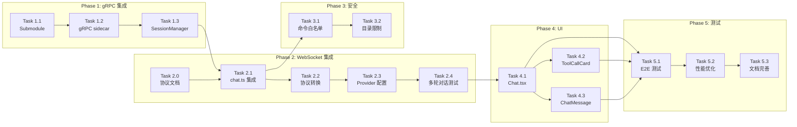

# openclaude 集成实现计划（修订版）

**日期**：2026-04-10
**基于**：2026-04-10-openclaude-integration-design.md（修订版）
**架构**：gRPC 代理模式

---

## 重大架构变更（ Spike 验证后）

| 原方案 | 问题 | 修订后 |
|--------|------|--------|
| `new OpenClaudeAgent(gateway, toolAdapter)` | 无此类可导出 | 使用 gRPC 服务器 |
| ToolAdapter 桥接工具 | 复杂度高，收益低 | 直接使用 openclaude 原生工具 |
| 直接复用 web-ai-ide AI Provider | 不可注入 | 通过环境变量传递 API Key |

---

## Phase 0：Spike 验证（已完成 ✅）

**验证结论**：
- openclaude v0.1.8 无导出类，不能作为库直接调用
- 内置 gRPC 服务器可用：`src/grpc/server.ts`
- proto 定义已确认：`text_chunk`, `tool_start`, `tool_result`, `action_required`
- Provider 配置通过 `applyProviderProfileToProcessEnv()` 设置（进程级别）
- 存在 `canUseTool` 钩子，可拦截工具调用

**关键发现**：
1. gRPC 是**单用户进程**，环境变量是进程级别，无法 per-request 隔离
2. **解决方案**：为每个用户启动独立的 gRPC sidecar 进程
3. 命令白名单可通过 `canUseTool` 钩子 + `action_required` 机制实现

**依赖**：无

---

## Phase 1：gRPC 服务集成（第 1-2 周）

### Task 1.1：添加 openclaude 作为 Git Submodule

**文件**：`packages/openclaude/`（从 `packages/openclaude-temp/` 移动）

**步骤**：
```bash
# 1. Fork 上游仓库（web-ai-ide 组织下）
#    https://github.com/Gitlawb/openclaude → https://github.com/web-ai-ide/openclaude

# 2. 删除临时目录，添加 submodule 指向 fork
rm -rf packages/openclaude-temp
cd packages
git submodule add git@github.com:web-ai-ide/openclaude.git openclaude
cd openclaude
git checkout -b web-ai-ide-modifications

# 3. 安装依赖并构建
npm install
npm run build
```

**Submodule 维护策略**：

| 场景 | 操作 |
|------|------|
| 首次集成 | Fork 上游 → Clone fork → 创建 `web-ai-ide-modifications` 分支 |
| 修改源码 | 在 `web-ai-ide-modifications` 分支上修改 |
| 同步上游 | `git checkout main && git pull origin main && git merge main` |
| 冲突处理 | 保留我们的 `canUseTool` 钩子逻辑，解决其他冲突 |

**重要**：所有源码修改都在 `web-ai-ide-modifications` 分支。Task 3.1 的 `canUseTool` 钩子修改必须在该分支上进行，不要直接修改 `main` 分支。

**验证**：
- [ ] submodule 指向 fork 仓库
- [ ] 分支为 `web-ai-ide-modifications`
- [ ] build 成功生成 dist/
- [ ] `node dist/cli.mjs --version` 正常运行

**依赖**：无

---

### Task 1.2：创建 AgentProcessManager（进程管理器）

**文件**：`packages/server/src/services/agent-process-manager.ts`

**实现内容**：

```typescript
import { spawn, ChildProcess } from 'child_process';
import * as grpc from '@grpc/grpc-js';
import * as protoLoader from '@grpc/proto-loader';
import * as net from 'net';
import path from 'path';

const PROTO_PATH = path.join(__dirname, '../../openclaude/src/proto/openclaude.proto');
const PORT_POOL_START = 50052;
const PORT_POOL_SIZE = 100;  // 端口池大小

interface AgentProcess {
  pid: number;
  port: number;
  userId: string;
  sessionId: string;
  lastActivity: number;
  proc: ChildProcess;
  client: any;  // gRPC 客户端
}

export class AgentProcessManager {
  private processes: Map<string, AgentProcess> = new Map();
  private creating: Map<string, Promise<AgentProcess>> = new Map();  // 并发去重
  private portPool: number[] = [];  // 可用端口池
  private usedPorts: Set<number> = new Set();  // 已用端口追踪
  private protoDescriptor: any;  // gRPC proto descriptor

  constructor() {
    // 初始化端口池
    for (let i = 0; i < PORT_POOL_SIZE; i++) {
      this.portPool.push(PORT_POOL_START + i);
    }

    const packageDefinition = protoLoader.loadSync(PROTO_PATH, {
      keepCase: true,
      longs: String,
      enums: String,
      defaults: true,
      oneofs: true,
    });
    this.protoDescriptor = grpc.loadPackageDefinition(packageDefinition);
  }

  private allocatePort(): number {
    if (this.portPool.length === 0) {
      throw new Error('Port pool exhausted');
    }
    const port = this.portPool.pop()!;
    this.usedPorts.add(port);
    return port;
  }

  private releasePort(port: number): void {
    this.usedPorts.delete(port);
    this.portPool.push(port);
  }

  private createGrpcClient(port: number): any {
    const client = new this.protoDescriptor.openclaude.v1.Agent(
      `localhost:${port}`,
      grpc.credentials.createInsecure()
    );
    return client;
  }

  async createProcess(userId: string, sessionId: string, provider: ProviderConfig): Promise<AgentProcess> {
    const port = this.allocatePort();

    let proc: ChildProcess | null = null;
    try {
      const env = {
        ...process.env,
        ...(provider.type === 'anthropic'
          ? {
              ANTHROPIC_API_KEY: provider.apiKey,
              ANTHROPIC_BASE_URL: provider.baseUrl,
              ANTHROPIC_MODEL: provider.model,
            }
          : provider.type === 'openai'
          ? {
              OPENAI_API_KEY: provider.apiKey,
              OPENAI_BASE_URL: provider.baseUrl,
              OPENAI_MODEL: provider.model,
            }
          : {}),
        GRPC_PORT: String(port),
      };

      proc = spawn('node', ['dist/cli.mjs', 'dev:grpc'], {
        cwd: path.join(__dirname, '../../openclaude'),
        env,
        stdio: ['ignore', 'pipe', 'pipe'],
      });

      await this.waitForPort(port);
    } catch (err) {
      if (proc) {
        proc.kill();
      }
      this.releasePort(port);
      throw err;
    }

    const client = this.createGrpcClient(port);

    const agentProcess: AgentProcess = {
      pid: proc.pid!,
      port,
      userId,
      sessionId,
      lastActivity: Date.now(),
      proc,
      client,
    };

    proc.on('exit', () => {
      this.releasePort(port);
    });

    this.processes.set(`${userId}:${sessionId}`, agentProcess);
    return agentProcess;
  }

  async getOrCreateProcess(userId: string, sessionId: string, provider: ProviderConfig): Promise<AgentProcess> {
    const key = `${userId}:${sessionId}`;

    if (this.processes.has(key)) {
      const existing = this.processes.get(key)!;
      existing.lastActivity = Date.now();
      return existing;
    }

    if (this.creating.has(key)) {
      return this.creating.get(key)!;
    }

    const promise = this.createProcess(userId, sessionId, provider)
      .finally(() => this.creating.delete(key));

    this.creating.set(key, promise);
    return promise;
  }

  async destroyProcess(userId: string, sessionId: string): Promise<void> {
    const key = `${userId}:${sessionId}`;
    const agentProcess = this.processes.get(key);

    if (agentProcess) {
      agentProcess.proc.kill();
      agentProcess.client.close?.();
      this.processes.delete(key);
      this.releasePort(agentProcess.port);
    }
  }

  cleanup(): void {
    const TIMEOUT_MS = 30 * 60 * 1000;
    const now = Date.now();

    for (const [key, agentProcess] of this.processes) {
      if (now - agentProcess.lastActivity > TIMEOUT_MS) {
        agentProcess.proc.kill();
        agentProcess.client.close?.();
        this.processes.delete(key);
        this.releasePort(agentProcess.port);
      }
    }
  }

  private waitForPort(port: number): Promise<void> {
    return new Promise((resolve, reject) => {
      const startTime = Date.now();
      const timeout = 10000;

      const check = () => {
        const socket = new net.Socket();

        socket.setTimeout(100);
        socket.on('connect', () => {
          socket.destroy();
          resolve();
        });
        socket.on('timeout', () => {
          socket.destroy();
          if (Date.now() - startTime < timeout) {
            setTimeout(check, 100);
          } else {
            reject(new Error(`Port ${port} did not become available within ${timeout}ms`));
          }
        });
        socket.on('error', () => {
          if (Date.now() - startTime > timeout) {
            reject(new Error(`Port ${port} did not become available within ${timeout}ms`));
          } else {
            setTimeout(check, 100);
          }
        });

        socket.connect(port, 'localhost');
      };

      setTimeout(check, 100);
    });
  }
}
```

**关键修复**：
1. **端口池**：使用 `portPool` + `usedPorts` 追踪，进程退出时调用 `releasePort()` 归还端口
2. **并发去重**：`creating` Map 追踪正在创建中的 Promise，避免重复启动进程
3. **变量命名**：`process` 改为 `agentProcess`，避免遮蔽全局对象
4. **轻量检测**：`waitForPort` 改用 `net.Socket` 而非 gRPC 客户端，避免资源泄漏

**验证**：
- [ ] AgentProcessManager 正确初始化
- [ ] 为每个用户创建独立的 sidecar 进程
- [ ] gRPC 客户端正确连接
- [ ] 进程生命周期正确管理
- [ ] 端口池正确分配（allocatePort）和回收（releasePort）
- [ ] 并发去重：多个同时请求同一用户 session 只会创建一个进程
- [ ] waitForPort 使用 net.Socket 不泄漏 gRPC 客户端
- [ ] 变量命名不遮蔽全局对象（agentProcess 而非 process）

**依赖**：Task 1.1

---

### Task 1.3：创建 AgentSessionManager（会话封装）

**文件**：`packages/server/src/services/agent-session-manager.ts`

**实现内容**：

```typescript
import * as grpc from '@grpc/grpc-js';

interface Session {
  call: grpc.ClientDuplexStream;
  lastActivity: number;
  userId: string;
}

interface PendingRequest {
  sessionId: string;
}

export class AgentSessionManager {
  private sessions: Map<string, Session> = new Map();
  private pendingRequests: Map<string, PendingRequest> = new Map();  // promptId → { resolve, timeout }

  constructor(private processManager: AgentProcessManager) {
    setInterval(() => this.processManager.cleanup(), 5 * 60 * 1000);
  }

  async createSession(
    userId: string,
    sessionId: string,
    provider: ProviderConfig,
    notifyFrontend: (type: string, data: any) => void
  ): Promise<string> {
    const agentProcess = await this.processManager.getOrCreateProcess(userId, sessionId, provider);
    const call = agentProcess.client.Chat();

    call.on('data', (msg: any) => {
      this.updateActivity(sessionId);
      this.handleGrpcMessage(sessionId, msg, notifyFrontend);
    });

    call.on('end', () => {
      this.remove(sessionId);
    });

    this.sessions.set(sessionId, {
      call,
      lastActivity: Date.now(),
      userId,
    });

    return sessionId;
  }

  private handleGrpcMessage(
    sessionId: string,
    msg: any,
    notifyFrontend: (type: string, data: any) => void
  ): void {
    if (msg.action_required) {
      const { prompt_id, question, type } = msg.action_required;

      this.pendingRequests.set(prompt_id, { sessionId });

      notifyFrontend('action_required', {
        promptId: prompt_id,
        question,
        actionType: type,
      });
      return;
    }

    if (msg.text_chunk) {
      notifyFrontend('text', { content: msg.text_chunk.text });
      return;
    }

    if (msg.tool_start) {
      notifyFrontend('tool_call', {
        toolCallId: msg.tool_start.tool_use_id,
        toolName: msg.tool_start.tool_name,
        arguments: JSON.parse(msg.tool_start.arguments_json || '{}'),
      });
      return;
    }

    if (msg.tool_result) {
      notifyFrontend('tool_result', {
        toolCallId: msg.tool_result.tool_use_id,
        result: {
          success: !msg.tool_result.is_error,
          output: msg.tool_result.output,
          error: msg.tool_result.is_error ? msg.tool_result.output : undefined,
        },
      });
      return;
    }

    if (msg.done) {
      notifyFrontend('done', {});
      return;
    }

    if (msg.error) {
      notifyFrontend('error', {
        content: msg.error.message,
        code: msg.error.code,
      });
      return;
    }
  }

  async handleUserConfirm(promptId: string, approved: boolean): Promise<void> {
    const pending = this.pendingRequests.get(promptId);
    if (!pending) {
      console.warn(`[AgentSessionManager] No pending request for promptId: ${promptId}`);
      return;
    }

    this.pendingRequests.delete(promptId);

    const reply = approved ? 'approved' : 'denied';
    const session = this.sessions.get(pending.sessionId);

    if (session) {
      session.call.write({ user_confirm: { prompt_id: promptId, reply } });
    }
  }

  hasSession(sessionId: string): boolean {
    return this.sessions.has(sessionId);
  }

  send(sessionId: string, message: any): boolean {
    const session = this.sessions.get(sessionId);
    if (!session) return false;
    session.call.write(message);
    session.lastActivity = Date.now();
    return true;
  }

  remove(sessionId: string): void {
    const session = this.sessions.get(sessionId);
    if (session) {
      session.call.cancel();
      this.sessions.delete(sessionId);
    }
  }

  private updateActivity(sessionId: string): void {
    const session = this.sessions.get(sessionId);
    if (session) {
      session.lastActivity = Date.now();
    }
  }

  destroy(): void {
    for (const [id] of this.sessions) {
      this.remove(id);
    }
  }
}
```

**user_confirm 回路流程**：

```
1. gRPC stream 收到 action_required 消息
   → handleGrpcMessage() 检测到 msg.action_required
   → 创建 60s 超时定时器
   → { sessionId, timeout } 存入 pendingRequests（prompt_id 为 key）
   → 通过 notifyFrontend 发送 { type: 'action_required', ... } 到前端

2. 前端发送 user_confirm 消息
   → chat.ts 收到 { type: 'user_confirm', promptId, approved }
   → 调用 sessionManager.handleUserConfirm(promptId, approved)

3. handleUserConfirm() 执行
   → 从 pendingRequests 取出 { sessionId, timeout }
   → 清除超时定时器
   → 根据 approved 决定 reply = 'approved' 或 'denied'
   → 通过 session.call.write({ user_confirm: { prompt_id, reply } }) 发送到 gRPC

4. gRPC 客户端收到回复，继续处理
```

**验证**：
- [ ] Session 创建和删除正确
- [ ] gRPC 流正确管理
- [ ] WebSocket 断开时正确清理
- [ ] action_required 触发后 pendingRequests 正确存储
- [ ] user_confirm 到达时正确唤醒等待的 Promise
- [ ] 超时后 pendingRequests 正确清理

**依赖**：Task 1.2

---

## Phase 2：WebSocket 集成（第 3-4 周）

### Task 2.0：WebSocket 消息协议文档（前置）

**文件**：`docs/websocket-protocol.md`（新建）

**协议定义**：

| 事件类型 | 方向 | 字段 | 说明 |
|---------|------|------|------|
| `message` | 前端→后端 | `{ type, content }` | 用户发送消息 |
| `text` | 后端→前端 | `{ type, content }` | AI 文本响应 |
| `tool_call` | 后端→前端 | `{ type, toolCallId, toolName, arguments }` | 工具调用请求 |
| `tool_result` | 后端→前端 | `{ type, toolCallId, result }` | 工具执行结果 |
| `action_required` | 后端→前端 | `{ type, promptId, question, actionType }` | 需用户确认的危险操作 |
| `user_confirm` | 前端→后端 | `{ type, promptId, approved }` | 用户确认/拒绝危险操作 |
| `done` | 后端→前端 | `{ type }` | AI 响应完成 |
| `error` | 后端→前端 | `{ type, content, code? }` | 错误信息 |

**user_confirm 回路流程**：

```
1. 后端→前端：发送 action_required 事件
   { type: 'action_required', promptId: 'xxx', question: '确认执行 rm -rf /?', actionType: 'dangerous_command' }

2. 前端弹出确认对话框

3. 前端→后端：用户点击后发送 user_confirm
   { type: 'user_confirm', promptId: 'xxx', approved: true }

   或用户拒绝：
   { type: 'user_confirm', promptId: 'xxx', approved: false }

   或超时（60s）：
   后端自动发送 { user_confirm: { prompt_id: 'xxx', reply: 'no' } }

4. 后端将确认结果通过 gRPC 发送给 openclaude sidecar
   { user_confirm: { prompt_id: 'xxx', reply: 'approved' | 'denied' | 'no' } }

5. openclaude 根据用户选择继续或终止操作
```

**依赖**：无

---

### Task 2.1：修改 chat.ts 集成 AgentSessionManager

**文件**：`packages/server/src/routes/chat.ts`

**实现内容**：

```typescript
import { AgentProcessManager } from '../services/agent-process-manager.js';
import { AgentSessionManager } from '../services/agent-session-manager.js';

const processManager = new AgentProcessManager();
const sessionManager = new AgentSessionManager(processManager);

socket.on('message', async (message: Buffer) => {
  try {
    const data = JSON.parse(message.toString());

    if (data.type === 'message' && data.content) {
      await sessionService.addMessage({
        sessionId: activeSessionId,
        role: 'user',
        content: data.content,
      });

      const providerConfig = await loadProviderConfigFromSession(activeSessionId);

      if (!sessionManager.hasSession(activeSessionId)) {
        const notifyFrontend = (type: string, payload: any) => {
          socket.send(JSON.stringify({ type, ...payload }));
        };
        await sessionManager.createSession(userId, activeSessionId, providerConfig, notifyFrontend);
      }

      sessionManager.send(activeSessionId, {
        request: {
          session_id: activeSessionId,
          message: data.content,
          working_directory: getWorkingDir(activeSessionId),
        },
      });
    }

    if (data.type === 'user_confirm') {
      sessionManager.handleUserConfirm(data.promptId, data.approved);
    }
  } catch (error) {
    socket.send(JSON.stringify({
      type: 'error',
      content: error instanceof Error ? error.message : 'Unknown error',
    }));
  }
});

socket.on('close', () => {
  sessionManager.remove(activeSessionId);
});
```

**验证**：
- [ ] WebSocket 消息正确转发到 gRPC
- [ ] gRPC 响应正确转发到前端
- [ ] user_confirm 正确处理
- [ ] WebSocket 断开时 session 正确清理

**依赖**：Task 1.3, Task 2.0

---

### Task 2.2：gRPC 事件到 WebSocket 协议转换（基于实际 proto）

**文件**：`packages/server/src/services/protocol-translator.ts`

**实现内容**（根据 proto 定义）：

```typescript
// 基于实际 proto 定义
interface GrpcServerMessage {
  text_chunk?: { text: string };
  tool_start?: { tool_name: string; arguments_json: string; tool_use_id: string };
  tool_result?: { tool_name: string; output: string; is_error: boolean; tool_use_id: string };
  action_required?: { prompt_id: string; question: string; type: string };
  done?: { full_text: string; prompt_tokens: number; completion_tokens: number };
  error?: { message: string; code: string };
}

export function translateToWebSocket(event: GrpcServerMessage, socket: any): void {
  if (event.text_chunk) {
    socket.send(JSON.stringify({
      type: 'text',
      content: event.text_chunk.text,
    }));
  }

  if (event.tool_start) {
    socket.send(JSON.stringify({
      type: 'tool_call',
      toolCallId: event.tool_start.tool_use_id,
      toolName: event.tool_start.tool_name,
      arguments: JSON.parse(event.tool_start.arguments_json),
    }));
  }

  if (event.tool_result) {
    socket.send(JSON.stringify({
      type: 'tool_result',
      toolCallId: event.tool_result.tool_use_id,
      result: {
        success: !event.tool_result.is_error,
        output: event.tool_result.output,
        error: event.tool_result.is_error ? event.tool_result.output : undefined,
      },
    }));
  }

  if (event.action_required) {
    socket.send(JSON.stringify({
      type: 'action_required',
      promptId: event.action_required.prompt_id,
      question: event.action_required.question,
      actionType: event.action_required.type,
    }));
  }

  if (event.done) {
    socket.send(JSON.stringify({ type: 'done' }));
  }

  if (event.error) {
    socket.send(JSON.stringify({
      type: 'error',
      content: event.error.message,
      code: event.error.code,
    }));
  }
}
```

**proto 字段映射确认**：
- `text_chunk.text` → `text.content`
- `tool_start.tool_use_id` → `tool_call.toolCallId`
- `tool_start.arguments_json` → `tool_call.arguments`（需要 JSON.parse）
- `tool_result.is_error` → `tool_result.success = !is_error`

**验证**：
- [ ] text_chunk 正确转换为 text
- [ ] tool_start 正确转换为 tool_call
- [ ] tool_result 正确处理 is_error 映射
- [ ] action_required 正确传递

**依赖**：Task 2.1

---

### Task 2.3：Provider 配置桥接

**文件**：`packages/server/src/services/agent-process-manager.ts`

**前置说明**：`createProcess` 方法已在 Task 1.2 实现，env 构建逻辑已包含 provider 类型条件判断（`anthropic` vs `openai`）。本 Task 确认多用户隔离机制。

**多用户隔离机制**：
- 每个用户的 sidecar 是独立进程（port 不同）
- 独立进程有独立的环境变量
- 用户 A 的请求不会影响用户 B 的 API Key

**验证**：
- [ ] Anthropic provider 正确设置环境变量
- [ ] OpenAI provider 正确设置环境变量
- [ ] 多用户同时使用时 API Key 隔离正确

**依赖**：Task 1.2

---

### Task 2.4：测试多轮对话

**验证内容**：
- [ ] 消息历史正确传递
- [ ] 多轮对话上下文保持
- [ ] Streaming 输出连续

**依赖**：Task 2.1, Task 2.2, Task 2.3

---

## Phase 3：安全与工具限制（第 5-6 周）

### Task 3.1：命令白名单（通过 canUseTool 钩子）

**文件**：`packages/openclaude/src/grpc/server.ts`（修改 openclaude 源码）

**方案决策**：采用**异步确认**方案。危险命令不静默拒绝，而是触发 `action_required` 等待用户确认后执行。

**架构说明**：`canUseTool` 需要访问 gRPC stream 来发送 `action_required` 并等待回复。由于 `canUseTool` 是在 gRPC handler 内部调用的，stream 通过闭包共享。

**实现内容**：

```typescript
// 在 openclaude 源码中配置 canUseTool 钩子
// packages/openclaude/src/grpc/server.ts

const ALLOWED_TOOLS = new Set([
  'Bash', 'Read', 'Write', 'Edit', 'Grep', 'Glob',
  'Notebook', 'WebSearch', 'WebFetch', 'TodoWrite',
]);

const BLOCKED_PATTERNS = [
  /sudo/, /su /, /chmod \d{4}/, /chown/,
  /curl.*-T/, /wget.*-O.*\//, /nc .*-e/,
];

function createCanUseTool(call: grpc.ClientDuplexStream, pendingRequests: Map<string, (reply: string) => void>) {
  return async function canUseTool(
    toolName: string,
    toolArgs: any
  ): Promise<{ behavior: 'allow' | 'deny', reason?: string }> {
    if (!ALLOWED_TOOLS.has(toolName)) {
      return { behavior: 'deny', reason: `Tool '${toolName}' is not in the allowed list` };
    }

    if (toolName === 'Bash' && toolArgs.command) {
      for (const pattern of BLOCKED_PATTERNS) {
        if (pattern.test(toolArgs.command)) {
          const promptId = `tool_${Date.now()}_${Math.random().toString(36).slice(2)}`;

          const reply = await new Promise<string>((resolve) => {
            pendingRequests.set(promptId, resolve);

            call.write({
              action_required: {
                prompt_id: promptId,
                question: `确认执行危险命令？\n\n\`${toolArgs.command}\`\n\n匹配危险模式: ${pattern}`,
                type: 'dangerous_command',
              },
            });

            setTimeout(() => {
              pendingRequests.delete(promptId);
              resolve('no');
            }, 60 * 1000);
          });

          if (reply === 'no') {
            return { behavior: 'deny', reason: 'User denied dangerous command' };
          }
          return { behavior: 'allow' };
        }
      }
    }

    return { behavior: 'allow' };
  };
}
```

**gRPC 服务器集成**：

```typescript
const pendingRequests = new Map<string, (reply: string) => void>();

const agent = new AgentService({
  canUseTool: createCanUseTool(call, pendingRequests),
});

call.on('data', (msg) => {
  if (msg.user_confirm) {
    const { prompt_id, reply } = msg.user_confirm;
    const resolve = pendingRequests.get(prompt_id);
    if (resolve) {
      pendingRequests.delete(prompt_id);
      resolve(reply);
    }
  }
});
```

**验证**：
- [ ] 非白名单工具被直接拒绝
- [ ] 危险 Bash 命令触发 action_required，等待用户确认
- [ ] 用户确认后命令继续执行
- [ ] 用户拒绝或超时后命令不执行

**依赖**：Task 2.2

---

### Task 3.2：工作目录限制

**文件**：`packages/server/src/services/tool-whitelist.ts`

**实现内容**：

```typescript
import path from 'path';

const WORKSPACE_ROOT = process.env.WORKSPACE_ROOT || '/tmp/web-ai-ide/workspaces';

export function isPathAllowed(targetPath: string): boolean {
  // path.resolve() 会规范化路径，消除 .. 等特殊字符
  const resolved = path.resolve(targetPath);

  // 只检查是否在允许的工作目录内
  return resolved.startsWith(WORKSPACE_ROOT);
}

export function sanitizeWorkingDirectory(sessionId: string): string {
  const userDir = path.join(WORKSPACE_ROOT, sessionId);

  // 确保目录存在
  if (!fs.existsSync(userDir)) {
    fs.mkdirSync(userDir, { recursive: true });
  }

  return userDir;
}
```

**验证**：
- [ ] 路径遍历攻击被阻止
- [ ] 工作目录隔离正确
- [ ] 目录不存在时自动创建

**依赖**：Task 3.1

---

## Phase 4：UI 优化（第 7-8 周）

### Task 4.1：修改 Chat.tsx 流式显示

**文件**：`packages/electron/src/components/Chat.tsx`

**实现内容**：与之前版本相同，添加 streaming 状态管理和 error/action_required 事件处理。

**依赖**：Task 2.2

---

### Task 4.2：优化 ToolCallCard 样式

**文件**：`packages/electron/src/components/ToolCallCard.tsx`

**实现内容**：应用 glass-panel 效果，与 web-ai-ide 设计系统统一。

**依赖**：Task 4.1

---

### Task 4.3：完善 ChatMessage 组件

**文件**：`packages/electron/src/components/ChatMessage.tsx`

**添加功能**：AI 消息前缀、streaming 高亮、错误状态显示。

**依赖**：Task 4.1

---

## Phase 5：测试与优化（第 9-10 周）

### Task 5.1：端到端测试

**测试场景**：
1. 用户登录 → 创建项目 → 打开 AI Chat
2. 发送 "帮我分析项目结构"
3. 验证命令白名单生效
4. 验证多轮对话

**依赖**：Phase 2, Phase 3

---

### Task 5.2：性能优化

**优化点**：
1. gRPC 连接池
2. Session 内存优化
3. 消息压缩

**依赖**：Task 5.1

---

### Task 5.3：文档完善

**文档内容**：
1. README 更新
2. 安全配置说明
3. 开发指南

**依赖**：Task 5.2

---

## 任务依赖图



---

## 检查点

### 检查点 1 (Phase 1 完成后)
- [ ] openclaude submodule 正确添加
- [ ] gRPC 服务器成功启动
- [ ] SessionManager 生命周期正确

### 检查点 2 (Phase 2 完成后)
- [ ] WebSocket 消息正确转发到 gRPC
- [ ] gRPC 响应正确转换到 WebSocket
- [ ] Provider 配置正确传递

### 检查点 3 (Phase 3 完成后)
- [ ] 命令白名单正确工作
- [ ] 路径限制正确工作
- [ ] 危险命令被拦截

### 检查点 4 (Phase 4 完成后)
- [ ] UI 混合风格正确
- [ ] glass-panel 效果正常

### 检查点 5 (Phase 5 完成后)
- [ ] 端到端测试通过
- [ ] 性能指标达标

---

## 与原方案对比

| 方面 | 原方案 | 修订方案 |
|------|--------|----------|
| 集成方式 | 库调用 | gRPC sidecar |
| 工具系统 | ToolAdapter 桥接 | openclaude 原生 + 白名单 |
| Provider | 直接注入 | 环境变量传递 |
| 生命周期 | Map 无管理 | AgentSessionManager |
| 安全 | 未考虑 | 命令白名单 + 目录限制 |

---

*计划创建：2026-04-10（修订版 - 基于 Spike 验证）*